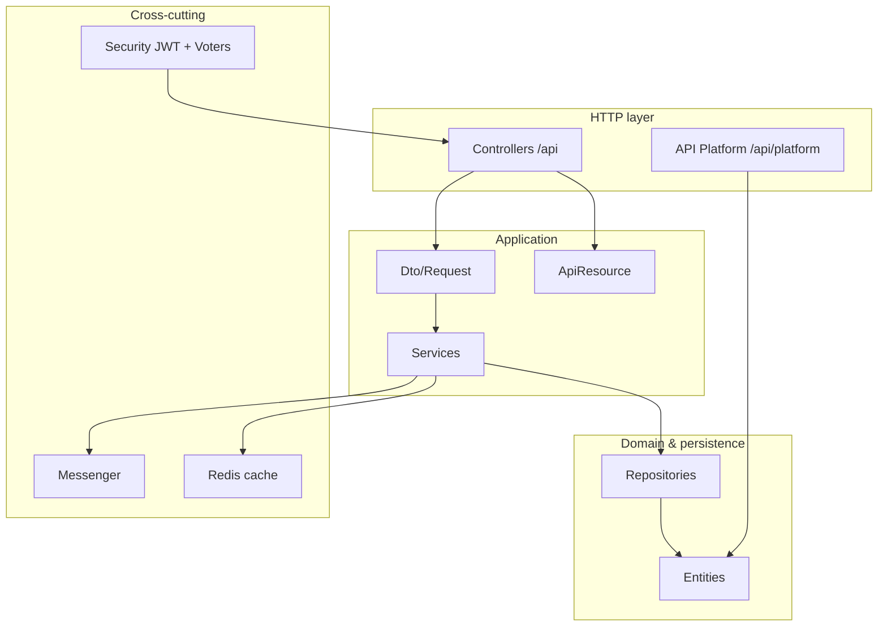

# Symfony Marketplace API

**Production-style multi-vendor commerce backend** — Symfony 7, JWT auth, Doctrine ORM, Redis, Docker, OpenAPI, PHPUnit.

[](https://github.com/sameh-bakleh/symfony-marketplace-api/actions/workflows/ci.yml)
[](https://www.php.net/)
[](https://symfony.com/)
[](LICENSE)

| | |
|---|---|
| **Repo** | [`symfony-marketplace-api`](https://github.com/sameh-bakleh/symfony-marketplace-api) |
| **Stack** | Symfony 7 · PHP 8.3 · Doctrine · JWT · Redis · Messenger · Docker · OpenAPI |

---

## At a glance

| Question | Answer |
|----------|--------|
| **What is it?** | A self-contained **REST API** for a multi-vendor marketplace: auth, catalog, cart, checkout, orders, wishlist, notifications. |
| **Why does it matter?** | Shows **end-to-end backend ownership** — security, domain logic, persistence, caching, async work, and API contracts — in one reviewable repo. |
| **What skills does it prove?** | Symfony 7 · JWT + RBAC · Doctrine · Redis · Messenger · Docker · OpenAPI · PHPUnit · validated DTOs · security voters |
| **How is it structured?** | Layered: Controllers → DTOs → Services → Repositories → Entities. REST writes at `/api`; API Platform catalog reads at `/api/platform`. |
| **How do I run it?** | `docker compose up` + migrations + fixtures — [Quick start](#quick-start) |
| **How do I test it?** | `./vendor/bin/phpunit` — **16 functional tests**, SQLite, transactional DB |
| **Why should a recruiter care?** | Skimmable proof of **senior PHP/API patterns** without wading through a monolith or tutorial boilerplate. |

---

## Recruiter summary

Portfolio backend sample for **Symfony Developer**, **PHP Backend Developer**, **Backend Engineer**, and **API Engineer** roles (Germany / EU).

This is **not** a step-by-step tutorial. It is a bounded commerce API that demonstrates how I build maintainable Symfony services: stateless JWT firewalls, role-based access with **voters**, request validation on DTOs, explicit JSON resources (no raw entity leakage), versioned Doctrine migrations, Redis-backed catalog cache, and Messenger-driven notifications after checkout.

**Start here if you have 5 minutes:** `config/packages/security.yaml` → `src/Security/Voter/` → `src/Service/Order/OrderService.php` → `tests/Functional/`

---

## Why this project

Marketplace domains force real backend decisions: **who may mutate which resource**, how to **validate input**, how to **cache public reads** without stale data, and how to **trigger side effects** (notifications) without blocking the HTTP response. This repo implements those concerns with standard Symfony components — the same stack used in many DACH/EU product teams.

---

## Skills demonstrated

| Skill | Where to see it |
|-------|-----------------|
| REST API design | `src/Controller/Api/`, [docs/API.md](docs/API.md) |
| JWT + refresh tokens | Lexik + Gesdinet, [docs/AUTH.md](docs/AUTH.md) |
| RBAC + resource auth | `ProductVoter`, `OrderVoter`, `access_control` |
| Request validation | `src/Dto/Request/`, `MapRequestPayload` |
| Doctrine ORM | `src/Entity/`, `migrations/` |
| Redis cache | `src/Service/Catalog/ProductService.php` (tag-aware listings) |
| Async processing | `OrderPlacedEvent` → Messenger → `PersistNotificationMessageHandler` |
| OpenAPI | Nelmio `/api/doc`, API Platform `/api/platform/docs` |
| Docker | `docker-compose.yml`, PHP-FPM + Nginx + MySQL + Redis |
| Automated tests | `tests/Functional/` (16 tests, auth + commerce + notifications) |
| CI | `.github/workflows/ci.yml` (PHPUnit, `composer validate`, audit) |

---

## Features

| Domain | Implemented |
|--------|-------------|
| Auth | Register (customer/seller), login, refresh, logout, `/api/me` |
| Catalog | Public categories; paginated products with filters; Redis listing cache |
| Seller | CRUD own products; image upload |
| Cart | Add, update, remove lines; clear |
| Orders | Place from lines or checkout cart; owner-scoped reads; admin status patch |
| Wishlist | Add, remove, list |
| Notifications | Persisted inbox; async dispatch on order placement |
| API Platform | Read-only published catalog at `/api/platform` |
| Admin | Category CRUD |
| Local demo | `MarketplaceFixtures` |

---

## Tech stack

| Layer | Technology |
|-------|------------|
| Runtime | PHP 8.3+, Symfony 7.4 |
| API | REST (`/api`) + API Platform 4 (`/api/platform`) |
| Persistence | Doctrine ORM 3, migrations |
| Databases | MySQL 8 (Docker default) · PostgreSQL 16 (optional profile) · SQLite (tests) |
| Auth | Lexik JWT + Gesdinet refresh |
| Cache / queues | Redis, Symfony Messenger |
| Docs | Nelmio ApiDoc, API Platform Swagger |
| Quality | PHPUnit 13, dama/doctrine-test-bundle |
| Ops | Docker Compose (PHP-FPM, Nginx, MySQL, Redis) |

---

## Architecture overview



**Request path (REST):** Client → Nginx → PHP-FPM → Security firewall → Controller → Service → Repository → MySQL/PostgreSQL.

**Dual API surface:** Custom controllers own **writes and commerce flows**; API Platform exposes **standards-friendly catalog reads** with custom state providers (active categories, published products only).

Details: [docs/ARCHITECTURE.md](docs/ARCHITECTURE.md) · Auth: [docs/AUTH.md](docs/AUTH.md) · Docker: [docs/DOCKER.md](docs/DOCKER.md)

---

## Folder structure

```
symfony-marketplace-api/
├── config/                 # Symfony config, security, packages
├── docker/                 # Nginx + PHP-FPM images
├── docs/                   # API.md, ARCHITECTURE.md, AUTH.md, DOCKER.md
├── migrations/             # Doctrine schema versions
├── public/                 # Front controller, uploads/
├── src/
│   ├── Controller/Api/     # REST endpoints
│   ├── Dto/Request/        # Validated input
│   ├── ApiResource/        # JSON response shapes
│   ├── Service/            # Business logic
│   ├── Repository/         # Queries
│   ├── Entity/             # ORM models
│   ├── Security/Voter/     # Resource authorization
│   ├── ApiPlatform/State/  # Catalog providers
│   ├── Message/            # Messenger messages
│   └── EventListener/      # Domain → async
├── tests/Functional/       # HTTP integration tests
├── docker-compose.yml
└── .github/workflows/ci.yml
```

---

## Testing strategy

**Approach:** Functional HTTP tests against the real Symfony kernel — no mocked HTTP layer.

| Aspect | Choice |
|--------|--------|
| Runner | PHPUnit 13 |
| Database | SQLite (`var/test.sqlite`), schema from entities in `tests/bootstrap.php` |
| Isolation | `dama/doctrine-test-bundle` (transaction rollback per test) |
| Auth in tests | Real login endpoint → Bearer token |
| Messenger | In-memory / sync transport in test env |
| JWT keys | Auto-generated in `tests/bootstrap.php` when missing |

**Current suite (16 tests):** auth register/login/refresh/logout · validation errors · public catalog · admin category CRUD auth · seller 403 on foreign product · cart CRUD · cart checkout · order placement · order access control · order notifications (Messenger) · wishlist · API Platform JSON-LD.

```bash
composer install
rm -rf var/cache/test
./vendor/bin/phpunit -c phpunit.dist.xml
```

---

## CI/CD strategy

GitHub Actions on push/PR to `main`:

| Job | Purpose |
|-----|---------|
| **PHPUnit** | `composer validate --strict` + full functional suite on PHP 8.3 |
| **Dependency audit** | `composer audit` (informational) |

Workflow: [`.github/workflows/ci.yml`](.github/workflows/ci.yml)

Contributing: [CONTRIBUTING.md](CONTRIBUTING.md) · Security: [SECURITY.md](SECURITY.md)

---

## Evaluate in 10 minutes

### Run with Docker

```bash
git clone https://github.com/sameh-bakleh/symfony-marketplace-api.git
cd symfony-marketplace-api
cp .env.example .env

mkdir -p config/jwt
openssl genpkey -algorithm rsa -pkeyopt rsa_keygen_bits:4096 -out config/jwt/private.pem
openssl pkey -in config/jwt/private.pem -out config/jwt/public.pem -pubout

docker compose up -d --build
docker compose exec app composer install
docker compose exec app php bin/console doctrine:migrations:migrate --no-interaction
docker compose exec app php bin/console doctrine:fixtures:load --no-interaction
```

| URL | Purpose |
|-----|---------|
| `http://localhost:8080` | API (Nginx → PHP-FPM) |
| `http://localhost:8080/api/doc` | Nelmio OpenAPI (REST) |
| `http://localhost:8080/api/platform/docs` | API Platform catalog docs |

**Demo logins** (local only, password `DemoPass2026!`): `customer@demo.marketplace` · `seller@demo.marketplace` · `admin@demo.marketplace`

### Example requests

```bash
# Public product catalog
curl -s http://localhost:8080/api/products | head

# Login (customer)
curl -s -X POST http://localhost:8080/api/auth/login \
  -H 'Content-Type: application/json' \
  -d '{"email":"customer@demo.marketplace","password":"DemoPass2026!"}'

# Authenticated cart (paste token from login response)
curl -s http://localhost:8080/api/cart \
  -H "Authorization: Bearer YOUR_TOKEN"
```

### API documentation

- REST OpenAPI UI: **http://localhost:8080/api/doc**
- API Platform docs: **http://localhost:8080/api/platform/docs**
- Reference: [`docs/API.md`](docs/API.md) · [`docs/AUTH.md`](docs/AUTH.md)

### Tests

```bash
composer install
./vendor/bin/phpunit -c phpunit.dist.xml   # 16 functional tests (SQLite)
```

---

## Quick start

See **[Evaluate in 10 minutes](#evaluate-in-10-minutes)** above for the copy-paste Docker flow.

**Without Docker:** `composer install` → configure `.env` → generate JWT keys → `doctrine:migrations:migrate` → `doctrine:fixtures:load` → `symfony server:start`

Full Docker guide: [docs/DOCKER.md](docs/DOCKER.md)

---

## Security & privacy

- Secrets live in **`.env`** and **`config/jwt/*.pem`** — both gitignored. Use `.env.example` only; `config/jwt/.gitkeep` documents the key directory.
- Passwords hashed via Symfony `password_hashers` (Argon2/bcrypt).
- Demo fixture accounts are for **local development only**.
- Docker Compose passwords are **dev defaults**, not production values.
- Known portfolio scope limits: no login rate limiting, no inventory locking on checkout. See [SECURITY.md](SECURITY.md).

---

## Recruiter note

| Item | Detail |
|------|--------|
| **Repo name** | `symfony-marketplace-api` |
| **Type** | Personal portfolio / engineering sample |
| **Best for** | Symfony, PHP backend, API-focused interviews |
| **Review order** | `security.yaml` → voters → `OrderService` → `ProductService` → `tests/Functional/` |
| **Companion clients** | Pair with a mobile or web client consuming `/api` (not required to evaluate this repo) |
| **Time to run** | ~5 min with Docker; ~30 sec to read this README |

---

## License

[MIT](LICENSE)
