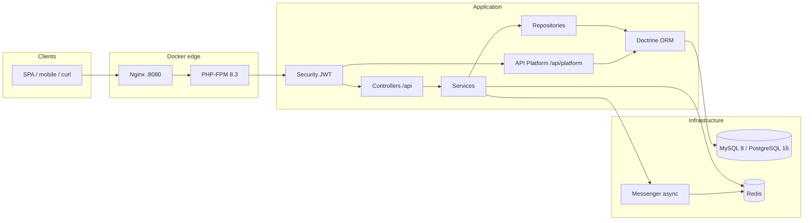

# Architecture

Symfony 7 marketplace API with a **layered REST surface** and a **read-only API Platform catalog**.

## Request flow



## Layer responsibilities

| Layer | Location | Role |
|-------|----------|------|
| HTTP | `src/Controller/Api/` | Routes, `MapRequestPayload` DTO binding, JSON responses |
| Input | `src/Dto/Request/` | Symfony Validator constraints |
| Output | `src/ApiResource/` | Stable JSON shapes (no entity leakage) |
| Application | `src/Service/` | Business rules: cart, orders, catalog, auth registration |
| Persistence | `src/Repository/` | Doctrine query builders |
| Domain | `src/Entity/` | ORM mappings, enums, lifecycle callbacks |
| Authorization | `src/Security/Voter/` | Resource-level checks (`ProductVoter`, `OrderVoter`) |
| Catalog reads | `src/ApiPlatform/State/` | Filter published/active data for API Platform |
| Async | `src/Message/`, `src/MessageHandler/` | Persist notifications after order placement |
| Events | `src/Event/`, `src/EventListener/` | `OrderPlacedEvent` → Messenger dispatch |

## Security model

Full auth flow, token lifecycle, roles, and voters: [docs/AUTH.md](AUTH.md).

1. **Firewalls** (`config/packages/security.yaml`):
   - `json_login` + Lexik success handler → `/api/auth/login`
   - Gesdinet `refresh_jwt` → `/api/auth/refresh`
   - Lexik JWT → remaining `/api/*`
2. **Access control**: explicit `PUBLIC_ACCESS` for docs, auth entrypoints, and safe GET catalog routes.
3. **Voters**: sellers may edit only their products; customers see only their orders; admins may update order status.

## Caching

`ProductService::listPublished()` uses **tag-aware Redis cache** (`product_listings` tag, 120s TTL). `ListingCacheInvalidator` invalidates tags when catalog data changes.

## Async notifications

On `OrderPlacedEvent`, `OrderPlacedNotifyListener` dispatches `PersistNotificationMessage` to the **Redis Messenger transport** (sync in tests via `when@test` routing). Run a consumer in Docker:

```bash
docker compose exec app php bin/console messenger:consume async -vv
```

See [docs/DOCKER.md](DOCKER.md) for the full container workflow.

## Database

Schema is versioned in `migrations/`. Initial migration creates users, seller profiles, categories, products, images, wishlist, orders, notifications, and refresh tokens. A second migration adds **carts** and **cart_items**.

Entities use PHP 8.3 **backed enums** for order/product status and user roles.

## Dual API design

| Surface | Prefix | Purpose |
|---------|--------|---------|
| Custom REST | `/api` | Full commerce: auth, cart, checkout, seller flows |
| API Platform | `/api/platform` | Hydra/JSON-LD catalog reads with custom state providers |

This split keeps write flows explicit in controllers while exposing standards-friendly catalog reads for tooling and clients that prefer API Platform.
