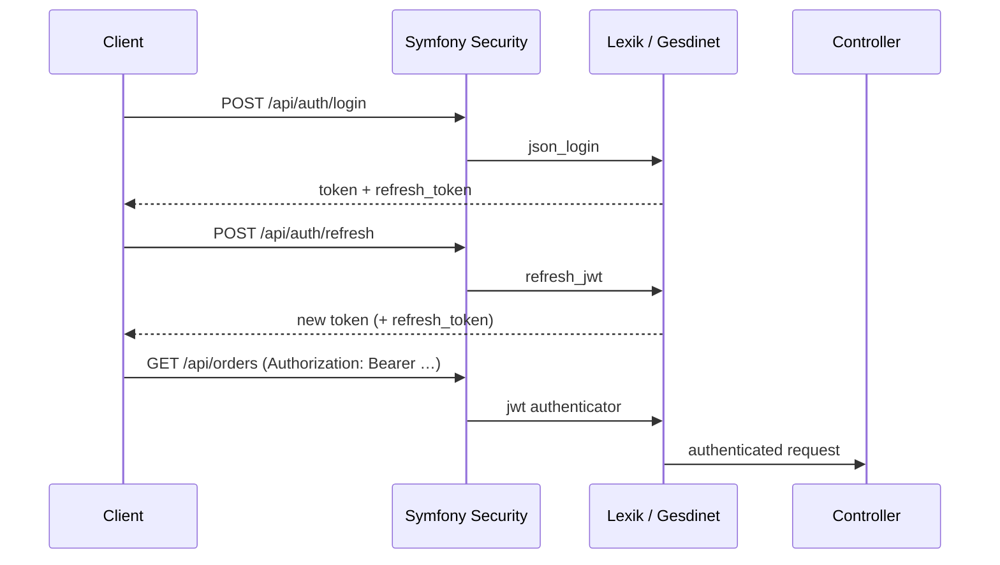

# Authentication & security

Stateless JWT authentication for a REST API, with refresh tokens, role-based access, and resource-level voters.

## Overview

| Concern | Implementation |
|---------|----------------|
| Access tokens | [Lexik JWT Authentication Bundle](https://github.com/lexik/LexikJWTAuthenticationBundle) |
| Refresh tokens | [Gesdinet JWT Refresh Token Bundle](https://github.com/markus-stockhausen/gesdinet-jwt-refresh-token-bundle) |
| Password hashing | Symfony `password_hashers` (`auto` → Argon2/bcrypt) |
| Route protection | Firewalls + `access_control` in `config/packages/security.yaml` |
| Resource auth | `ProductVoter`, `OrderVoter` |
| Input validation | Symfony Validator on DTOs (`MapRequestPayload`) |

## Firewalls

Three API firewalls handle authentication before controllers run:



| Firewall | Pattern | Mechanism |
|----------|---------|-----------|
| `api_login` | `^/api/auth/login$` | `json_login` → Lexik success handler |
| `api_refresh` | `^/api/auth/refresh$` | `refresh_jwt` (Gesdinet) |
| `api` | `^/api` | Lexik JWT bearer validation |

Login and refresh are handled entirely by Symfony Security — see stub routes in `AuthTokenController` (documented for OpenAPI only).

## Token lifecycle

### 1. Register

```http
POST /api/auth/register
Content-Type: application/json

{
  "email": "buyer@example.com",
  "password": "password123",
  "displayName": "Buyer",
  "role": "customer"
}
```

`role` may be `customer` or `seller`. Sellers get a `SellerProfile` row. Passwords are hashed before persistence.

### 2. Login

```http
POST /api/auth/login
Content-Type: application/json

{ "email": "buyer@example.com", "password": "password123" }
```

**Response (200):**

```json
{
  "token": "<access_jwt>",
  "refresh_token": "<refresh_token>"
}
```

Send the access token on protected routes:

```http
Authorization: Bearer <access_jwt>
```

### 3. Refresh

```http
POST /api/auth/refresh
Content-Type: application/json

{ "refresh_token": "<refresh_token>" }
```

Returns a new access token (and typically a rotated refresh token, per Gesdinet config).

### 4. Logout

```http
POST /api/auth/logout
Authorization: Bearer <access_jwt>
Content-Type: application/json

{ "refresh_token": "<refresh_token>" }
```

Revokes the refresh token server-side. Access tokens remain valid until they expire (stateless JWT trade-off).

### 5. Current user

```http
GET /api/me
Authorization: Bearer <access_jwt>
```

## Roles

Defined in `App\Enum\UserRole` and stored on `User::$roles`:

| Role | Constant | Typical access |
|------|----------|----------------|
| Admin | `ROLE_ADMIN` | Category CRUD, all orders, order status updates |
| Seller | `ROLE_SELLER` | Own product CRUD, seller profile |
| Customer | `ROLE_CUSTOMER` | Cart, checkout, own orders, wishlist |

Symfony's role hierarchy is flat — each endpoint uses `#[IsGranted('ROLE_…')]` or voters.

## Access control (public routes)

`access_control` in `security.yaml` whitelists safe reads and auth entrypoints:

- `GET` `/api/categories`, `/api/products` — public catalog
- `POST` `/api/auth/register`, `/api/auth/login`, `/api/auth/refresh`
- API Platform catalog reads under `/api/platform/categories` and `/api/platform/products`
- OpenAPI UIs: `/api/doc`, `/api/platform/docs`

All other `/api/*` routes require `IS_AUTHENTICATED_FULLY`.

## Security voters

Voters enforce **resource ownership** beyond coarse roles.

### `ProductVoter` (`PRODUCT_EDIT`)

| User | Can edit product? |
|------|-------------------|
| Admin | Yes |
| Seller (owner) | Yes |
| Seller (not owner) | No |
| Customer | No |

Used on seller product `PATCH` / `DELETE` / image upload.

### `OrderVoter`

| Attribute | Admin | Customer (owner) | Customer (other) |
|-----------|-------|------------------|------------------|
| `ORDER_VIEW` | Yes | Yes | No |
| `ORDER_UPDATE_STATUS` | Yes | No | No |

## JWT keys

RSA key pair lives in `config/jwt/` (gitignored). Generate locally:

```bash
mkdir -p config/jwt
openssl genpkey -algorithm rsa -pkeyopt rsa_keygen_bits:4096 -out config/jwt/private.pem
openssl pkey -in config/jwt/private.pem -out config/jwt/public.pem -pubout
```

Set `JWT_PASSPHRASE` in `.env` if keys are encrypted. PHPUnit auto-generates unencrypted test keys in `tests/bootstrap.php`.

## Configuration files

| File | Purpose |
|------|---------|
| `config/packages/security.yaml` | Firewalls, `access_control`, test password cost |
| `config/packages/lexik_jwt_authentication.yaml` | Key paths, token TTL |
| `config/packages/gesdinet_jwt_refresh_token.yaml` | Refresh token TTL, entity mapping |
| `src/Entity/RefreshToken.php` | Persisted refresh tokens |

## Security boundaries (portfolio scope)

This sample intentionally omits production hardening such as login rate limiting, token blocklists, and inventory locking. See [SECURITY.md](../SECURITY.md) for reporting vulnerabilities and known limits.
